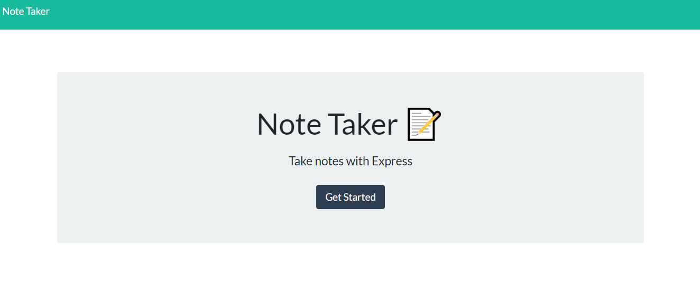

# Notetaker

##  Description
This is an application that can be used to write, save, and delete notes using express on the backend to save and retrieve note data from a JSON file.  Technologies used: HTML, JQuery, Node.js, Express.js.

## Screenshot of Website  

## Github Repository
[notetaker](https://github.com/sford4186/notetaker)

## Deployed Site
https://secret-chamber-25028.herokuapp.com/

 